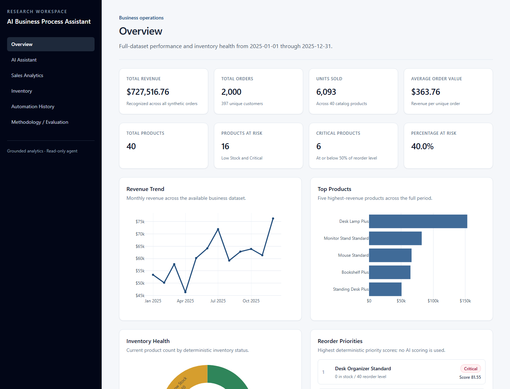
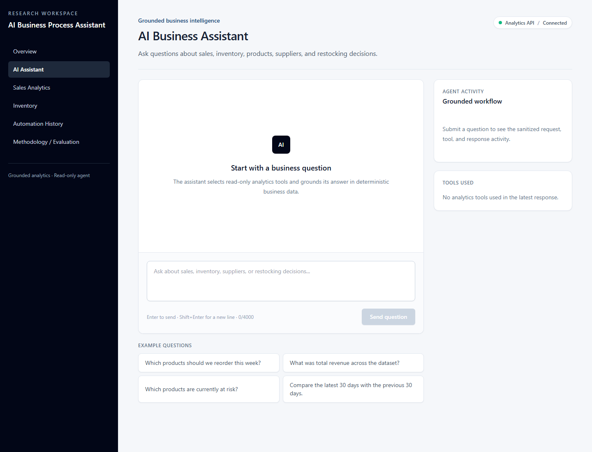
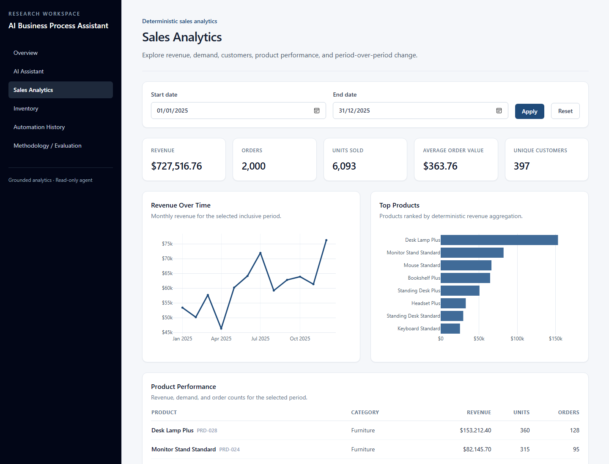
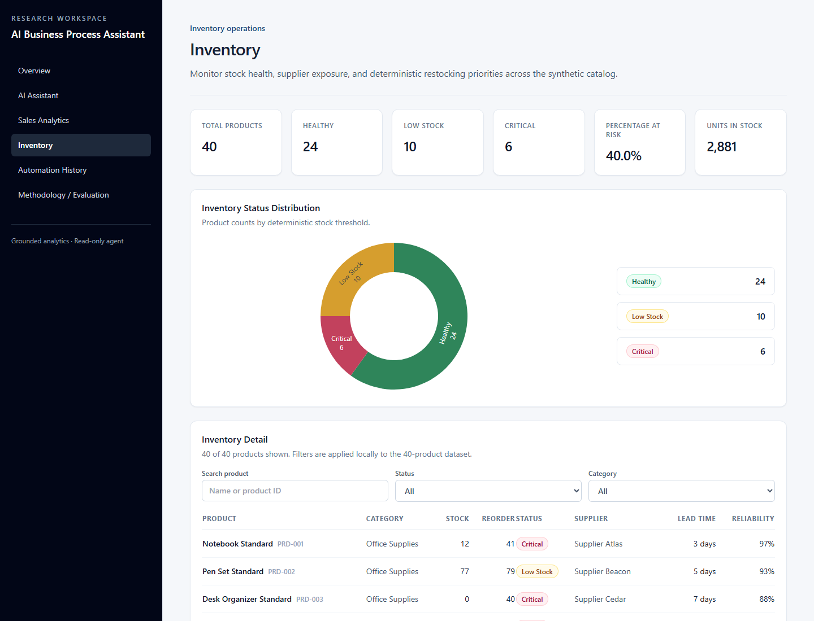
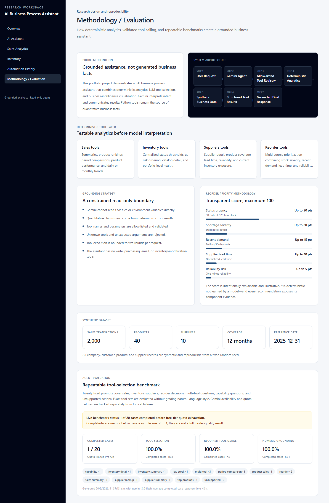

# AI Business Process Assistant

A portfolio-grade, read-only business intelligence application combining Google Gemini tool calling with deterministic Python analytics. Gemini interprets requests and selects allow-listed tools; sales, inventory, supplier, and reorder facts come from reproducible synthetic data.

## Live Demo

Deployment is prepared for Vercel and Render. Public links will be added after deployment.

## Project Overview

General chatbots can sound convincing while inventing business numbers. This project separates language-model interpretation from calculation: Gemini handles intent and communication, while tested Python tools remain the source of quantitative facts. The result is an explainable assistant plus a conventional analytics workspace—not a chatbot wrapping raw files.

## Key Features

- Gemini function calling through a validated, allow-listed registry
- Ten deterministic tools for sales, inventory, suppliers, and reorder analysis
- Grounded reorder recommendations with transparent scoring
- Overview, Sales Analytics, and Inventory dashboards with Plotly
- Period comparison, product performance, stock risk, and supplier analysis
- Browser-local Automation History with sanitized execution traces
- Twenty-case offline/live agent evaluation framework
- Read-only safety boundary, bounded tool loop, and sanitized errors
- Responsive, accessible React interface

## Architecture

```text
User Request
    → Gemini Agent
    → Allow-listed Tool Registry
    → Deterministic Analytics
    → Synthetic Business Data
    → Structured Tool Results
    → Grounded Response
```

The FastAPI backend is a modular monolith. Gemini cannot read CSV files directly or invoke arbitrary Python functions.

## Technology Stack

- **Frontend:** React, TypeScript, Vite, Tailwind CSS, React Router, Plotly
- **Backend:** Python, FastAPI, Pandas, Uvicorn
- **AI:** Google Gemini through `google-genai`
- **Testing:** Pytest and FastAPI's HTTPX-based test client
- **Deployment target:** Vercel frontend and Render backend

## Deterministic Tools

| Domain | Tools |
|---|---|
| Sales | `get_sales_summary`, `get_top_products`, `compare_sales_periods`, `get_product_sales` |
| Inventory | `get_inventory`, `get_low_stock_products`, `get_inventory_summary` |
| Suppliers | `get_supplier`, `get_supplier_summary` |
| Reorder | `get_reorder_recommendations` |

See [the tool catalog](docs/tool-catalog.md) for parameters and result structures.

## Reorder Recommendation Methodology

Only Critical and Low Stock products are recommended. The maximum score is 100:

| Component | Maximum |
|---|---:|
| Status urgency | 50 points (Critical) or 25 points (Low Stock) |
| Shortage severity | 20 points |
| Recent demand | 15 points |
| Supplier lead time | 10 points |
| Supplier reliability risk | 5 points |

The score is deterministic, intentionally transparent, and not machine-learned. Recent demand uses the inclusive trailing 30-day window ending at the latest dataset date.

## Dataset

All data is fictional and generated with a fixed seed:

- 2,000 sales transactions
- 40 products across four categories
- 10 suppliers
- 12 months of activity
- Reference date: `2025-12-31`

The linked CSV files are committed under `data/`. No real company, customer, or personal data is included.

## Evaluation

The benchmark contains 20 versioned cases covering sales, inventory, suppliers, reordering, multi-tool questions, capabilities, and unsupported requests.

```bash
python evaluation/run_agent_evaluation.py --mode offline
python evaluation/run_agent_evaluation.py --mode live
```

Offline mode validates schemas, unique IDs, registered tools, and stable facts without Gemini. Live mode measures tool selection, required-tool usage, unexpected tools, numeric grounding, completion, tool count, and latency. It uses at most two retries for transient 503 responses and distinguishes service availability from quota exhaustion.

The recorded live run was quota-limited: **1 of 20 cases completed before free-tier quota exhaustion**. For that completed case (`n=1`), tool-selection accuracy, required-tool usage, and numeric-grounding match were each 100%. This is not presented as a full model-quality result. See [the evaluation methodology](docs/evaluation-methodology.md).

## Screenshots

### Overview


### AI Assistant


### Sales Analytics


### Inventory


### Methodology / Evaluation


## Local Setup

### Backend

From the repository root:

```bash
python -m venv .venv
pip install -r backend/requirements.txt
cd backend
uvicorn app.main:app --reload --env-file ../.env
```

Copy `.env.example` to `.env` and set values locally:

```text
GEMINI_API_KEY=
GEMINI_MODEL=gemini-3.6-flash
FRONTEND_ORIGINS=
```

`FRONTEND_ORIGINS` accepts comma-separated origins. Local Vite origins are always retained. Never commit `.env`.

### Frontend

```bash
cd frontend
npm install
npm run dev
```

Copy `frontend/.env.example` to `frontend/.env.local` when an override is needed:

```text
VITE_API_BASE_URL=http://127.0.0.1:8000
```

Never put secrets in `VITE_` variables; Vite exposes them to browser code.

## Testing

```bash
python -m pytest
python evaluation/run_agent_evaluation.py --mode offline
cd frontend
npm run build
npm audit
```

Normal tests inject fake Gemini clients and make no live AI requests.

## API Overview

- `GET /health`
- `POST /api/assistant/query`
- `GET /api/sales/summary`, `/api/sales/top-products`, `/api/sales/trend`, `/api/sales/compare`
- `GET /api/products/{product_id}/sales`
- `GET /api/inventory`, `/api/inventory/summary`, `/api/inventory/low-stock`
- `GET /api/inventory/reorder-recommendations`
- `GET /api/suppliers`, `/api/suppliers/{supplier_id}`

Interactive API documentation is available at `/docs` while the backend is running.

## Security and Grounding

- Gemini receives schemas and structured results, not raw CSV access
- Tool names and arguments are allow-listed and validated
- Unknown functions and unexpected arguments are rejected
- The agent is read-only and cannot order, email, or modify inventory
- Tool execution is bounded to five rounds
- Client-visible traces omit prompts, raw tool payloads, credentials, and chain-of-thought
- Browser history is bounded and local; no backend chat store exists
- Production CORS uses explicit configured origins, never a wildcard

## Deployment Preparation

### Render backend

Use the **repository root**, not `backend`, because runtime data is stored in the repository-level `data/` directory.

- Root directory: repository root / blank
- Build: `pip install -r backend/requirements.txt`
- Start: `cd backend && uvicorn app.main:app --host 0.0.0.0 --port $PORT`
- Health check: `/health`
- Environment: `GEMINI_API_KEY`, `GEMINI_MODEL`, `FRONTEND_ORIGINS`

### Vercel frontend

- Root directory: `frontend`
- Framework: Vite
- Build: `npm run build`
- Output: `dist`
- Environment: `VITE_API_BASE_URL=https://your-render-service.onrender.com`

`frontend/vercel.json` provides the SPA fallback for direct route navigation. Add the final Vercel origin to Render's `FRONTEND_ORIGINS`.

## Limitations

- Synthetic rather than operational data
- No real ERP connector or write/action tools
- No production authentication or authorization model
- No persistent multi-user chat or audit database
- Gemini availability, latency, and quota affect responses
- Reorder weights are illustrative business rules
- The recorded live evaluation has only one completed case

## Future Work

- Add a controlled real-business-data connector
- Add persistent, access-controlled audit history
- Introduce approval-gated action tools
- Expand and rerun the live benchmark under stable quota
